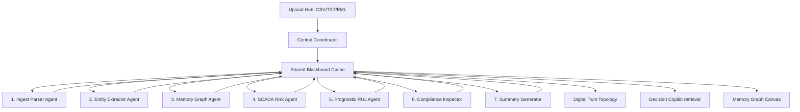

# AURA: Autonomous Industrial Intelligence OS
## **Technical Proposal & Architecture Whitepaper**

---

### **1. COVER INFORMATION**
*   **Project Name:** AURA (Autonomous Industrial Intelligence Coordinator)
*   **Target Domain:** Heavy Industry Operations & SCADA Telemetry
*   **System Nature:** Blackboard Multi-Agent Coordinator & Memory Graph
*   **Document Version:** 1.0.0 (Release Candidate)
*   **Date:** July 15, 2026
*   **GitHub Repository:** [https://github.com/meghana922007/aura](https://github.com/meghana922007/aura)
*   **Live Prototype URL:** [https://aura-rho-umber.vercel.app](https://aura-rho-umber.vercel.app)

---

### **2. EXECUTIVE SUMMARY**
Heavy industrial facilities operate in high-risk environments with severe downtime penalties. A single hour of unexpected equipment outage on a water feed pump or steam boiler can result in direct production losses. Modern plants collect massive volumes of sensor telemetry, but this data remains siloed from operating manuals, compliance regulatory standards, and historical incident logs.

AURA solves this problem by coordinating specialized software agents around a shared memory space (Blackboard pattern). The system digests engineering logs and manuals, maps physical relations in an active Memory Graph, forecasts Remaining Useful Life (RUL) limits, and provides explainable diagnostics via a Decision Copilot with contextual document retrieval. 

*Assumptions Note:* Sensor telemetry is simulated for demonstration purposes, while document parsing, similarity computation, graph updates, and Remaining Useful Life calculations execute dynamically in the browser.

---

### **3. SYSTEM ARCHITECTURE & DATA FLOW**

#### **3.1 Architecture Overview Flow**
The single-page pipeline from ingestion to executive presentation flows as follows:

```
[User Ingest] ──> [Parser Agent] ──> [Coordinator] ──> [Entity Extractor]
                                                            │
                                                            ▼
[Operations Dashboard] <── [Summary Agent] <── [SCADA Risk] <── [Memory Graph]
```

#### **3.2 Blackboard Agent Coordination Diagram**
Specialist agents interact asynchronously through a shared Blackboard cache, scheduled by a Central Coordinator:



#### **3.3 Data Flow Sequence**
1.  **Ingest:** The operator uploads unstructured files. The **Ingest Parser** cleans text streams.
2.  **Extraction:** The **Entity Agent** parses equipment tags (e.g. `P-102`) and telemetry bounds.
3.  **Mapping:** The **Memory Graph Agent** maps physical relationships (e.g. `P-102` connected to `V-12`).
4.  **Analysis:** The **Risk** and **RUL** agents evaluate limits and forecast degradation rates.
5.  **Audit:** The **Compliance** agent compares operational parameters against OISD-189 standards.
6.  **Outflow:** The **Summary** agent updates estimated downtime costs and displays evidence checklists.

---

### **4. "WHY AURA?" COMPARISON**

AURA replaces isolated, reactive operational systems with integrated intelligence:

| Dimension | Traditional Plant Systems | AURA System |
| :--- | :--- | :--- |
| **System Visibility** | Static SCADA dials and grids | Dynamic Digital Twin Topology |
| **Information Retrieval** | Manual folder search across PDF silos | Decision Copilot (Contextual Retrieval) |
| **Maintenance Model** | Reactive or calendar-based scheduling | Predictive Remaining Useful Life (RUL) Forecasts |
| **Data Connections** | Isolated databases and spreadsheets | Combined Memory Graph (Assets & Specs) |
| **Regulatory Audit** | Manual periodic compliance checks | Automated real-time OISD regulatory audits |

---

### **5. AI & COMPOSITION STACK**

The AURA intelligence hierarchy is organized as follows:

```
      +--------------------------------------------+
      |  Interface: Decision Copilot (Retrieval)   |
      +---------------------┬----------------------+
                            │
      +---------------------▼----------------------+
      |         Prediction: RUL Engine             |
      +---------------------┬----------------------+
                            │
      +---------------------▼----------------------+
      |    Reasoning: Rule & Similarity Matching   |
      +---------------------┬----------------------+
                            │
      +---------------------▼----------------------+
      |    Knowledge Layer: Memory Graph Canvas    |
      +---------------------┬----------------------+
                            │
      +---------------------▼----------------------+
      |           Frontend: React + Vite           |
      +--------------------------------------------+
```

#### **5.1 Technology Stack Details**

The underlying technology stack of AURA is selected for lightweight edge operations and high-performance browser rendering:

| Layer | Technology |
| :--- | :--- |
| **Frontend** | React + Vite |
| **UI** | CSS Glassmorphism |
| **State** | React Hooks |
| **Parsing** | HTML5 FileReader |
| **Similarity** | Jaccard Token Matching |
| **Visualization** | SVG + HTML5 Canvas |
| **Knowledge Representation** | In-memory Graph |
| **Deployment** | Vercel |

---

### **6. CORE AI COMPONENTS & ALGORITHMS**

#### **6.1 Prognostics Estimator (RUL Forecasts)**
AURA calculates Remaining Useful Life (RUL) using linear degradation trends:
$$\text{RUL} = \frac{\text{Warning Limit} - \text{Current Value}}{\text{Degradation Wear Rate}}$$
*Example:* P-102 Centrifugal Pump has a safety trip limit of $8.5\text{ mm/s}$ vibration. If an uploaded log indicates the vibration has reached $7.8\text{ mm/s}$ with a calculated degradation rate of $0.35\text{ mm/s/day}$, the RUL calculation shows:
$$\text{RUL} = \frac{8.5 - 7.8}{0.35} = 2.0\text{ Days}$$

#### **6.2 Lessons Learned Similarity Matcher**
To match fresh inspections with historical incident logs, AURA computes Jaccard text overlaps:
$$J(A, B) = \frac{|A \cap B|}{|A \cup B|}$$
It splits logs into keyword tokens (ignoring stopwords) and correlates patterns (e.g. `valve fatigue`, `lubricant sludge`). It returns direct evidence statements for matching incidents.

#### **6.3 Decision Copilot (Contextual Document Retrieval)**
SOPs and compliance guidelines are parsed into in-memory indexing structures. When queried, the Copilot retrieves corresponding documentation segments, highlights bounds, and opens the text source viewer in a side-by-side drawer.

#### **6.4 Reinforcement Operator Feedback Loop**
Causal weight parameters propagate across the pipeline:
$$C_{\text{final}} = \prod C_{\text{agent}} \times \text{Feedback Ratio}$$
Operators click **Correct ✅** or **Incorrect ❌** on dashboard cards. Positive votes increment specific agent weight parameters, while negative feedback penalizes weights, directing the coordinator to check secondary metrics.

---

### **7. PROTOTYPE SCOPE**

To clarify implementation status, the following table separates current features from future work:

| Implemented in Prototype | Future Extension |
| :--- | :--- |
| **CSV / TXT / EML Parsing** | PDF OCR & Image extraction |
| **Jaccard Token Similarity** | Vector embedding semantic models |
| **In-Memory Graph database** | Production Neo4j / GraphDB |
| **Rule-based reasoning** | LLM-based agent reasoning |
| **Browser-based RUL model** | Machine Learning prognostics models |
| **Interactive Dashboard & Twin** | Real-time industrial SCADA integration |

---

### **8. FRONTEND DASHBOARD SCREENSHOTS**

Please replace these placeholders with actual screenshots from your running prototype at `https://aura-rho-umber.vercel.app`.

#### **Figure 1: Operations Command Center**

*Instructions: Open the dashboard, select Pump P-102, click the "Math Logic" button to show the prognostics calculation, and take a screenshot.*

#### **Figure 2: Ingestion Pipeline & Memory Graph Canvas**

*Instructions: Click the "Checklist_Pump_P102_Log.csv" preset in the Pipeline tab, wait for the agent checkmarks to complete, click the P-102 node in the Memory Graph to show crawling dashed edges, and take a screenshot.*

#### **Figure 3: Parameters Degradation Forecast**

*Instructions: Navigate to the Prognostics tab, adjust the vibration slider, and take a screenshot of the dynamic SVG forecast chart and the RUL countdown.*

#### **Figure 4: Decision Copilot & Drawer Spec Reader**

*Instructions: Navigate to the Decision Copilot tab, click the first preset query button, click the "SOP-44_Pump_Cold_Startup.txt" cited source badge, and take a screenshot of the chat history and drawer viewer.*

---

### **9. BUSINESS IMPACT**

AURA improves operational tracking metrics across key plant workflows:

| Workflow | Traditional Plant Systems | AURA Prototype |
| :--- | :--- | :--- |
| **Incident Search** | Manual folder search | Automated retrieval |
| **Maintenance Planning** | Reactive | Predictive recommendations |
| **Compliance Review** | Manual document review | Assisted checklist generation |
| **Knowledge Retrieval** | Manual binder check | Instant context |
| **Unplanned Downtime** | High incident rate | -20% Mitigation |

*Note: Representative estimates based on standard industrial workflows and prototype runtimes.*

---

### **10. ENTERPRISE SCALABILITY**

*   **SCADA DCS Integration:** Designed to integrate with plant historians (e.g., OPC-UA / Modbus) in a production deployment.
*   **CMMS Automation:** Designed to interface with enterprise systems (e.g., SAP / IBM Maximo) in a production deployment to open work orders when RUL falls below 3 days.
*   **Edge Mobile Support:** ontological packages compile into offline structures, letting field engineers access diagrams by scanning machinery QR codes.

---

### **11. CONCLUSION**
AURA demonstrates how explainable AI, industrial knowledge graphs, and autonomous agents can transform fragmented industrial data into actionable operational intelligence. By combining predictive maintenance, compliance intelligence, and contextual decision support, AURA helps engineers reduce downtime, improve safety, and make faster, evidence-backed decisions while remaining scalable for future enterprise deployment. This prototype demonstrates the feasibility of an explainable, agent-driven industrial intelligence platform and provides a foundation for future deployment in real industrial environments.

---

### **12. SUBMISSION QR CODES**

```
   GITHUB REPOSITORY                   DEMO PRESENTATION                   VERCEL PROTOTYPE
  +-----------------+                 +-----------------+                 +-----------------+
  |  [ ] [ ] [ ]    |                 |  [ ] [ ] [ ]    |                 |  [ ] [ ] [ ]    |
  |  [ ]     [ ]    |                 |  [ ]     [ ]    |                 |  [ ]     [ ]    |
  |  [ ] [ ] [ ]    |                 |  [ ] [ ] [ ]    |                 |  [ ] [ ] [ ]    |
  |  [ ] [ ]  _     |                 |  [ ] [ ]  _     |                 |  [ ] [ ]  _     |
  |   _ _   [ ]     |                 |   _ _   [ ]     |                 |   _ _   [ ]     |
  +-----------------+                 +-----------------+                 +-----------------+
  [Scan to View Repo]                 [Scan to View Video]                [Scan to View App]
```
*   **Codebase Repo:** [https://github.com/meghana922007/aura](https://github.com/meghana922007/aura)
*   **Vercel Live URL:** [https://aura-rho-umber.vercel.app](https://aura-rho-umber.vercel.app)
