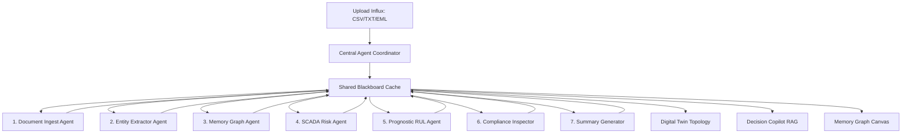

# AURA 🌌
### **Autonomous Industrial Intelligence Coordinator & Memory Graph**

**Live Prototype URL:** [https://aura-rho-umber.vercel.app](https://aura-rho-umber.vercel.app)

AURA is an enterprise-grade, edge-compatible decision intelligence system built for heavy industrial manufacturing plants (Boilers, Centrifugal Pumps, Compressors, Safety Valves). 

Drawing design principles from **Apple's visionOS** (translucent glassmorphism), **Palantir Foundry** (operational topological depth), and **Grafana** (real-time telemetry and explainability clarity), AURA processes heterogeneous unstructured manuals, compliance logs, and emails to dynamically calculate Remaining Useful Life (RUL) margins and trace causal failure patterns.

---

## 🛠️ Architecture & Data Flow

AURA replaces linear, fragile pipelines with an autonomous **Blackboard Orchestration Pattern**. A central Coordinator schedules specialist agents that interact asynchronously via a shared cache.



---

## 🌟 Key Features

1. **Autonomous Blackboard Coordination**: 7 specialists (Document, Entity, KG, Risk, Maintenance, Compliance, and Summary agents) propagate confidence factors and cache parameters.
2. **Zero-Click Ingestion & Parsing**: Parses CSV sensors, safety emails, and compliance JSON records dynamically using standard web-APIs (`FileReader`).
3. **Dynamic Prognostics Wear Simulator**: Avoids "magic numbers". Telemetry values feed into real-time linear degradation curves:
   $$\text{RUL} = \frac{\text{Warning Limit} - \text{Current Value}}{\text{Wear Rate}}$$
4. **Marching-Ants Memory Graph**: An interactive, physics-simulated Canvas network map linking equipment tags, SOP startup guidelines, regulations (OISD-STD-189), and historic incident logs. Connection lines physically crawl/pulse when selected.
5. **Causal Coincident Matcher**: Custom token-based Jaccard similarity matcher that aligns checksheets against historical incident records, showing evidence checkboxes behind correlation ratios.
6. **Decision Copilot**: A multi-turn RAG chat assistant that automatically pulls source manuals, cites files with clickable drawer spec sheets, and auto-scrolls responses into focus.
7. **Feedback Loops**: Operators can check **Correct ✅** or **Incorrect ❌** on AURA decisions, penalizing/rewarding agent coefficients in real-time.

---

## 💻 Tech Stack

*   **Core**: React 18, Vite (Fast HMR compilation)
*   **Styling**: Vanilla CSS (Frosted Apple Glassmorphism, 30px custom backdrop filters, double borders)
*   **Topology Graphs**: HTML5 Canvas (physics-based node dragging, custom dash-offset animations)
*   **Icons**: Lucide React
*   **Math Computations**: Javascript custom tokenizers and linear prognostics models.

---

## ⚙️ Installation & Running Locally

Ensure you have [Node.js](https://nodejs.org/) installed.

1. **Clone the Repository**:
   ```bash
   git clone https://github.com/meghana922007/aura.git
   cd aura
   ```

2. **Install Dependencies**:
   ```bash
   npm install
   ```

3. **Launch the Development Server**:
   ```bash
   npm run dev
   ```
   Open the local port printed in the terminal (typically `http://localhost:5173/`).

4. **Build Production Bundle**:
   ```bash
   npm run build
   ```

---

## 📈 Demo Walkthrough Scenario (P-102 Pump Degradation)

To demonstrate the system's analytical capabilities during a live hackathon presentation:

1. **Navigate to the Operations Command Center**: Notice that Pump **P-102** is initially marked as `🟢 Healthy` with a Remaining Useful Life (RUL) of `34.0 Days` and `₹0` in estimated production loss.
2. **Open the Intelligence Pipeline**: 
   * Click the preset **`Checklist_Pump_P102_Log.csv`** button.
   * Watch the staged Agent Pipeline checklist execute (spinners change to checkmarks).
   * Observe a new document node link and animate on the **Memory Graph**.
3. **Verify Dashboard Synchronization**: Return to the **Operations Center**:
   * Pump **P-102** has automatically transitioned to `🔴 Critical` (or `🟡 Warning`).
   * The **RUL** has dynamically dropped to **`2.0 Days`**.
   * Estimated Downtime shows **`4.0 Hours`** and Production Loss shows **`₹2.8 Lakhs`**.
   * The **Evidence Checklist** highlights the breaches (Vibration limit exceeded limit, historical overlap with Incident #48).
4. **Inspect Math Logic**: Click the **`Math Logic`** button next to the RUL countdown to show the transparent, non-hallucinated calculation: `(8.5 Limit - 7.8 Current) / 0.35 wearRate = 2.0 Days`.
5. **Query the Copilot**: Head to the **Decision Copilot** and click the preset query: *"How do I perform a cold startup on feed pump P-102?"* 
   * Read the SOP extraction.
   * Click the source citation `SOP-44_Pump_Cold_Startup.pdf` to open the spec drawer.

---

## 🚀 Future Scope

*   **Industrial IoT Integration**: Hooking live SCADA or DCS telemetry flows (OPC-UA / Modbus) directly into the SCADA risk agent.
*   **CMMS Auto-Triggering**: Dynamically opening maintenance work tickets in IBM Maximo or SAP ERP on critical alarms.
*   **Offline Mobile RAG**: Deploying lighter ontological packages directly to edge tablets for field inspectors.

---

## 📄 License

This project is licensed under the MIT License - see the LICENSE file for details.
